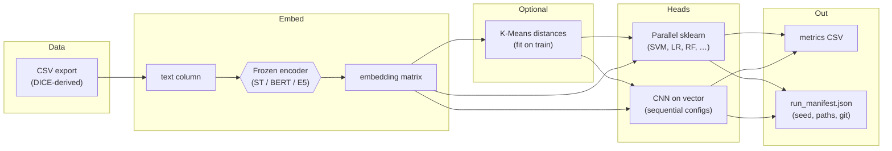
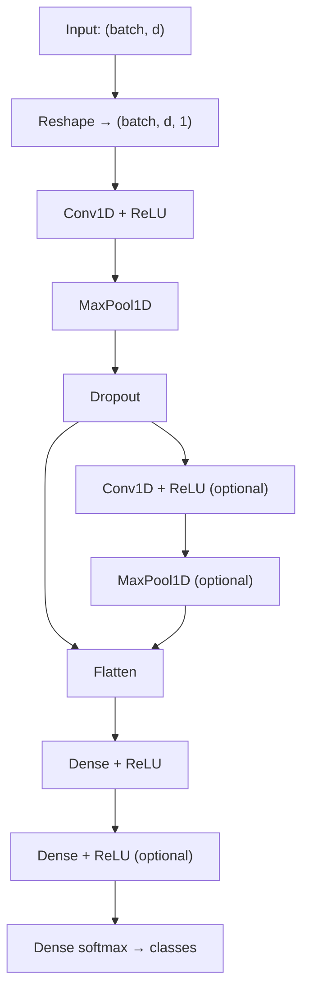

# Reasoning over Transformer Embeddings for Interpretable Crime News Classification

[](https://www.python.org/)
[](https://colab.research.google.com/github/tayyabrehman96/Semantic-Compression-and-Conceptual-Symbolic-Reasoning-over-Transformer-Embeddings/blob/main/Reasoning%20over%20Transformer%20Embeddings%20for%20Interpretable%20Crime%20News%20Classification.ipynb)
[](https://github.com/tayyabrehman96/Semantic-Compression-and-Conceptual-Symbolic-Reasoning-over-Transformer-Embeddings/stargazers)
[](https://github.com/tayyabrehman96/Semantic-Compression-and-Conceptual-Symbolic-Reasoning-over-Transformer-Embeddings/network/members)

**Code:** [github.com/tayyabrehman96/Semantic-Compression-and-Conceptual-Symbolic-Reasoning-over-Transformer-Embeddings](https://github.com/tayyabrehman96/Semantic-Compression-and-Conceptual-Symbolic-Reasoning-over-Transformer-Embeddings)  
**Paper (IEEE Xplore):** [Document 11427118](https://ieeexplore.ieee.org/abstract/document/11427118)

Modular, reproducible code for interpretable **multi-class** crime-news classification: **frozen transformer embeddings**, optional **K-Means** features, **parallel** sklearn heads (**joblib** / separate processes), and an optional **1D-CNN** (TensorFlow). This repo includes **`src/`** (CLI + stages), **notebooks**, and **`Methodology.drawio`** for GitHub. Heavy or private files stay ignored (see `.gitignore`).

---

## Dataset (DICE) — links

| Resource | Link |
|----------|------|
| **DICE** (Dataset of Italian Crime Event news) — institutional record | [hdl.handle.net/11380/1335212](https://hdl.handle.net/11380/1335212) (IRIS UNIMORE) |
| **Mirror / code & documentation** (community GitHub) | [github.com/federicarollo/Italian-Crime-News](https://github.com/federicarollo/Italian-Crime-News) |
| **Listing** | [Papers with Code — Italian crime news / DICE](https://paperswithcode.com/dataset/italian-crime-news) |

**License:** **CC BY-NC-SA 4.0** — non-commercial use with attribution. If you **commit a CSV** under `data/`, you remain responsible for license compliance and file size.

**Canonical file:** `data/dice_crime_news_modena.csv` (or set `DICE_CSV`). Columns: `text`, `word2vec_tag` (or `DICE_TEXT_COL` / `DICE_LABEL_COL`).

| Item | Value |
|------|--------|
| **Corpus** | **DICE** — Italian crime news (province of Modena, 2011–2021; ~10.4k articles, 13 crime categories in the reference corpus). |
| **Canonical local file** | `data/dice_crime_news_modena.csv` |
| **Legacy alias** | `data/italian_crime_news.csv` if the canonical file is absent. |

---

## Architecture diagrams

### End-to-end pipeline



### CNN head on frozen embeddings

Frozen vectors are reshaped as length \(d\), one channel: `Reshape((d, 1))` → **Conv1D** → **MaxPooling1D** → **Dropout** → (optional second block) → **Flatten** → **Dense** → **Dropout** → **Dense(softmax)**. Implementations: `src/models_cnn.py`.



---

## Code layout (`src/`)

| Path | Role |
|------|------|
| `src/__main__.py` | Entry: `python -m src …` |
| `src/cli.py` | Subcommands: `run`, `cache-embed`, `train`, `run-subprocess`, `legacy-run` |
| `src/subprocess_runner.py` | Chains **two OS processes** (embed, then train) to free GPU RAM |
| `src/stages/embed_stage.py` | Encoder dispatch (ST / BERT / E5) |
| `src/stages/artifact_io.py` | NPZ + `.meta.json` between stages |
| `src/stages/sklearn_stage.py` | Parallel sklearn heads + `results_io` |
| `src/stages/cnn_stage.py` | Keras CNN configs + `results_io` |
| `src/stages/orchestrate.py` | In-process full pipeline + train-from-artifact |
| `src/config.py` | Paths, standard dataset name, seeds, `N_JOBS` |
| `src/data_io.py` | Load CSV, stratified split, `LabelEncoder` |
| `src/embeddings.py` | SentenceTransformers (MiniLM, E5), mean-pool BERT |
| `src/clustering.py` | K-Means distance features (train+test or train-only) |
| `src/models_sklearn.py` | SVM, LR, ExtraTrees, RF, GB, optional XGBoost |
| `src/models_cnn.py` | Keras Conv1D builder + default configs |
| `src/evaluation.py` | Accuracy, weighted / **macro F1** |
| `src/parallel_runner.py` | **joblib** multiprocessing for sklearn |
| `src/results_io.py` | `run_manifest.json` + metrics CSV under `results/runs/run_*` |
| `src/run_experiment.py` | Back-compat: `python -m src.run_experiment` (flat flags) |
| `src/sklearn_baseline.py` | Quick ST/BERT + parallel sklearn (no run folder) |

Legacy `13052025.py` / `140525.py` are Colab snapshots. **Notebooks** in this repo: `Reasoning over Transformer Embeddings for Interpretable Crime News Classification.ipynb`, `AAMS.ipynb`. Reproduce numerically with the `src/` CLI when you need exact manifests.

---

## Results (reproducible outputs + paper alignment)

1. **From this repo:** each `python -m src run …` (or `python -m src.run_experiment …`) writes **`results/runs/run_<UTC>/`** with:
   - **`run_manifest.json`** — seed, CSV path, columns, class list, embedding mode, git commit (if available).
   - **`metrics_sklearn.csv`** or **`metrics_cnn.csv`** — `accuracy`, `precision_weighted`, `recall_weighted`, `f1_weighted`, **`f1_macro`** (use macro F1 for imbalanced crime categories).

2. **From the paper:** report the metrics and settings described in [IEEE Xplore document 11427118](https://ieeexplore.ieee.org/abstract/document/11427118) (e.g. strong **macro-F1** in the ~**74%** range in the published experiments, depending on split and embedding backbone). Match **seed**, **data export**, and **model id** when comparing tables to this code.

---

## Reproducibility checklist

1. **Python** 3.9+; fresh venv recommended.  
2. **`pip install -r requirements.txt`** (TensorFlow only for `--mode cnn`).  
3. **Obtain DICE** via the [dataset links](#dataset-dice--links) above; save locally as `data/dice_crime_news_modena.csv`.  
4. **Seeds:** `DICE_SEED` (default `42`) for splits and K-Means; CNN branch sets TensorFlow seed accordingly.  
5. **Parallel sklearn:** `DICE_N_JOBS=-1` (all cores) or `1` to debug.  
6. **Compare runs** only when `DICE_CSV`, `DICE_SEED`, and embedding id are identical.

---

## Commands

**Preferred (subcommands):**

```powershell
python -m venv .venv
.\.venv\Scripts\activate
pip install -r requirements.txt
$env:DICE_CSV = "data\dice_crime_news_modena.csv"

# Full pipeline in one process
python -m src run --mode sklearn --embed sentence_transformer
python -m src run --mode sklearn --embed e5 --kmeans 8

# Stage 1: write NPZ (encoder exits) then Stage 2: train (loads NPZ only)
python -m src cache-embed --out .\_work\stage_embed.npz --embed sentence_transformer
python -m src train --artifact .\_work\stage_embed.npz --mode sklearn --kmeans 0

# Two separate Python processes (same as cache-embed + train)
python -m src run-subprocess --work-dir .\_work --embed sentence_transformer --mode sklearn

# Same flags as before
python -m src legacy-run --mode sklearn --embed bert_italian
python -m src.run_experiment --mode cnn --embed sentence_transformer
python -m src.sklearn_baseline --backend sentence_transformer
```

---

## Environment variables (reference)

| Variable | Default | Meaning |
|----------|---------|---------|
| `DICE_CSV` | `data/dice_crime_news_modena.csv` | Path to CSV |
| `DICE_TEXT_COL` | `text` | Text column |
| `DICE_LABEL_COL` | `word2vec_tag` | Label column |
| `DICE_SEED` | `42` | Random state |
| `DICE_TEST_SIZE` | `0.2` | Holdout fraction |
| `DICE_N_JOBS` | `-1` | joblib parallel jobs |
| `DICE_RESULTS_DIR` | `results/runs` | Parent of timestamped folders |
| `ST_MODEL` | MiniLM multilingual | SentenceTransformer id |
| `BERT_MODEL` | `dbmdz/bert-base-italian-cased` | Hugging Face BERT |
| `E5_MODEL` | `intfloat/multilingual-e5-large-instruct` | E5 encoder |
| `DICE_CNN_EPOCHS` | `15` | CNN epochs |
| `DICE_CNN_BATCH` | `32` | CNN batch size |

---

## What belongs in Git

- **`src/`**, **`requirements.txt`**, **`README.md`**, **`.ipynb` notebooks**, **`Methodology.drawio`**, **`data/*.csv`** (if you ship DICE under license), **`data/.gitkeep`**, **`results/.gitkeep`**, figures such as `Methodology.png`, `ml_accuracy_minilm.png`, `Untitled Diagram.drawio`.  
- **Not** in Git: `results/runs/*`, `ICCP 25/`, most `*.pdf` / `*.pptx`, `Updated Results/`, `Experimentation/`, `__pycache__` — see `.gitignore`.

---

## Citation

- **Paper:** cite the IEEE publication: [IEEE Xplore abstract 11427118](https://ieeexplore.ieee.org/abstract/document/11427118).  
- **Dataset:** cite **DICE** and respect **CC BY-NC-SA 4.0**; use the [IRIS handle](https://hdl.handle.net/11380/1335212) and/or the dataset authors’ preferred reference.  
- **Code:** [Semantic-Compression-and-Conceptual-Symbolic-Reasoning-over-Transformer-Embeddings](https://github.com/tayyabrehman96/Semantic-Compression-and-Conceptual-Symbolic-Reasoning-over-Transformer-Embeddings) on GitHub.
